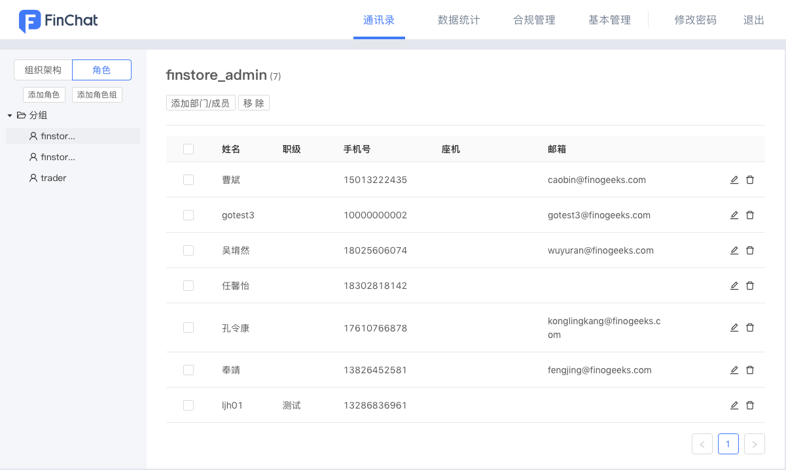
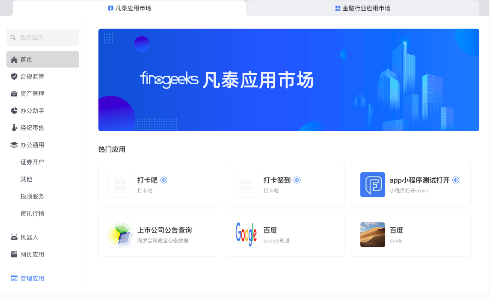
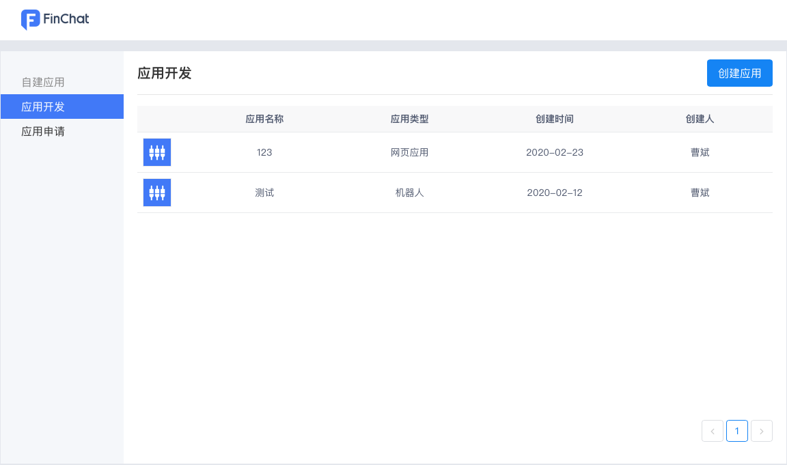
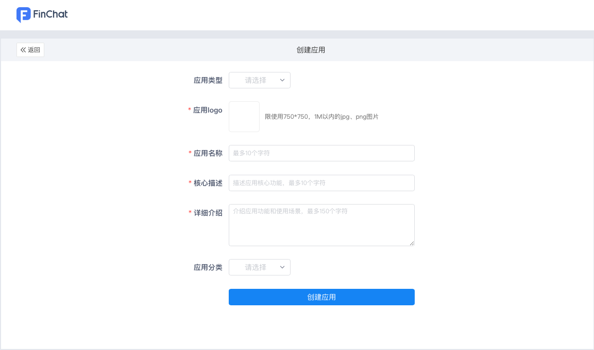
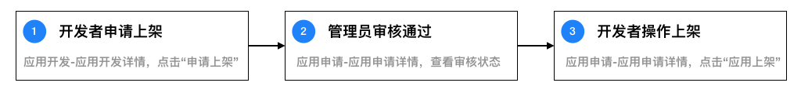
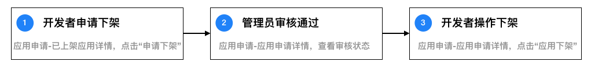
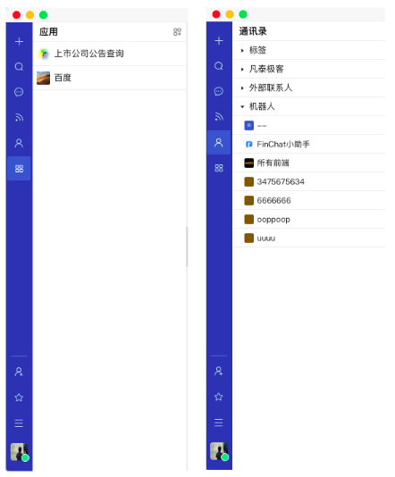
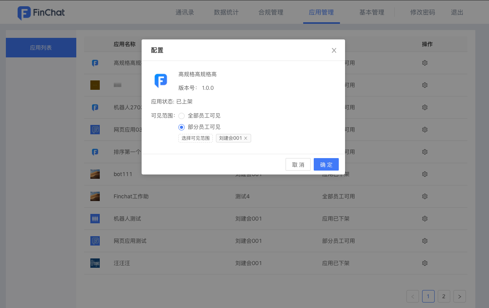
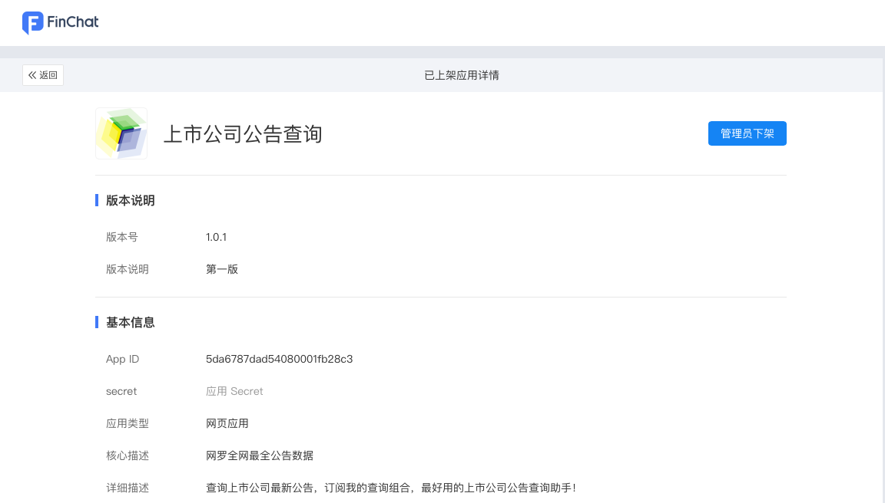

## 概述
应用市场支持开发和上架机器人和网页应用两种类型的应用，来支持机构将已有的或新的系统连接到IM，通过IM实现更高效的工作流。

FinChat同时支持使用小程序类型的应用，但小程序的开发和上架流程已迁移至独立的平台，详见：[小程序开发](https://mp.finogeeks.com/mop/document/)

## 自建应用流程
### 1.创建应用
1.1在机构管理后台-通讯录管理-角色页面，将成员添加为应用开发者（finstore-dev）和应用管理员（finstore-admin）角色

1.2应用开发者/管理员可以点击应用市场窗口内“管理应用”打开应用开发后台

1.3在应用开发后台，选择“应用开发”，再点击“创建应用”

 

1.4在“创建应用”页面完善相关基础信息即可创建应用

 

### 2.开发应用
目前应用市场支持开发机器人和网页应用两种应用。

更具体的开发流程可以查看：
* [机器人开发](https://docs.finogeeks.club/docs/finchat/#/bot)
* [网页应用开发](http://)

开发信息：

| 参数 | 说明 |
| -------- | -------- | 
| AppID     |  应用唯一标识，创建应用即生成    | 
| secret     |  应用秘钥，开发者后台创建应用后，在应用详情页获取 | 
| 应用主页  |  在FinChat中打开网页应用时默认跳转的URL   | 
| 回调URL   |   应用市场将会把订阅的事件推送给此URL   | 
| Token     |  可任意填写或采用应用市场自动生成的，用于校验回调请求的合法性 | 

### 3.上架应用

3.1在完成应用开发部分的配置后，开发者继续完成填写应用预览图、版本号、版本说明即可申请上架

应用资料信息：

| 参数 | 说明 |
| --------| -------- | 
| 应用名称 |   最多10个字符  | 
| 应用logo |  要求使用尺寸为750*750，1M以内的jpg、png图片| 
| 核心描述  |  最多10个字符，突出应用的核心功能   | 
| 详细介绍  |   最多120个字符，详细介绍应用功能和使用场景   | 
| 应用分类  |   根据应用的使用场景进行选择   | 
| 预览图  | 最多4张图片，要求使用尺寸为1280*720，2M以内的jpg、png图片  | 
| 版本号  | 格式必须为X.Y.Z  | 
| 版本说明  | 描述该版本应用的更新内容  | 

3.2应用上架：应用进行任何变更，都须上架才可以生效。

上架应用流程：
 

3.3应用下架：当应用计划停止服务时，开发者可以申请下架应用。

开发者下架应用流程：
 

### 4.测试应用
应用首次上架后，默认仅开发者可用，开发者可在应用列表或机器人列表查看和测试应用。

 

### 5.管理应用
5.1机构管理员可以登录机构管理后台-应用管理配置应用的可用范围，只有可用范围的用户才可以使用该应用

 
 
5.2机构管理员可以在应用开发后台-应用审核-已上架应用详情直接下架应用

 
