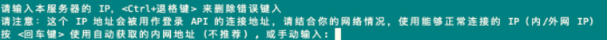
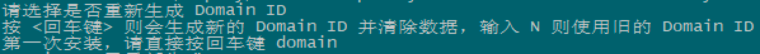
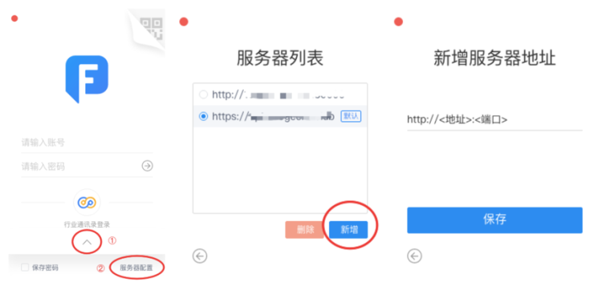
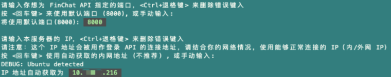

| 项目     |              要求              |      |
| -------- | :----------------------------: | :--: |
| 最低配置 | CPU 2核、 内存16GB、 硬盘100GB |      |
| 最少数量 |           1台服务器            |      |
| 系统版本 |    Ubuntu 14.93 TLS 或以上     |      |

## 获取与执行一键部署脚本

1. 登录服务器，在任意目录切换为 root 用户执行以下命令：
`wget https://static.finogeeks.club/deploy/autoDeploy && bash autoDeploy`
   >或使用 sudo 执行以下命令：
>`sudo wget https://static.finogeeks.club/deploy/autoDeploy && bash autoDeploy`

2. 等待脚本执行完毕，并根据脚本提示，按需修改参数：

* 当如图提示 “`选择端口`” 时，可根据自身需要修改，默认为 `8000` 端口。若 `8000` 端口未被信息安全部门开放或被占用，可根据需要输入自定义端口。
 

* 当提示 “`输入 IP 地址`” 时，可根据自身需要修改，默认为自动获取本机（当前服务器）的 eth0 网卡内网地址。
若内网地址无法在用户环境被连通，请根据需要输入本机公网地址、主防火墙/路由器地址或其他网络地址。
 

- 当提示是否 “`重新生成 Domain ID`” 时，请根据技术对接专家的指导进行操作，选择重新生成或不重新生成。请注意，初次部署需要重新生成。
 

- 最后，当出现绿色闪烁字符提示 “`FinChat 部署完成`“ 时，则代表全部部署完毕。

## 创建用户与试用

1. 请点击 [此处](https://www.finogeeks.com/download/finchat?hideHeader) 下载对应平台的帆信 (FinChat) 客户端，或手动输入地址：https://www.finogeeks.com/download/finchat

2. 安装完成后，按下图提示，修改用于登陆的服务器地址：
   
  >此处的 `<地址>` 与 `<端口>` 请填入脚本中所提示的地址，如图：
  > 
  >
  >**注意： `<端口>` 后不应有斜杠 ”`/`“**

3. 创建用户
   1. 以 `http://<IP>:<端口>/contact-front/#/contact` 的格式，打开后台管理地址。
   2. 打开后，使用账号 “`super`”、密码 “`SUPER`” 登录（均不含引号）。
   3. 下载并参照 FinChat 管理后台使用手册进行账号添加等功能试用。
      * 手册下载地址：https://static.finogeeks.club/deploy/Finchat-Manual.pdf