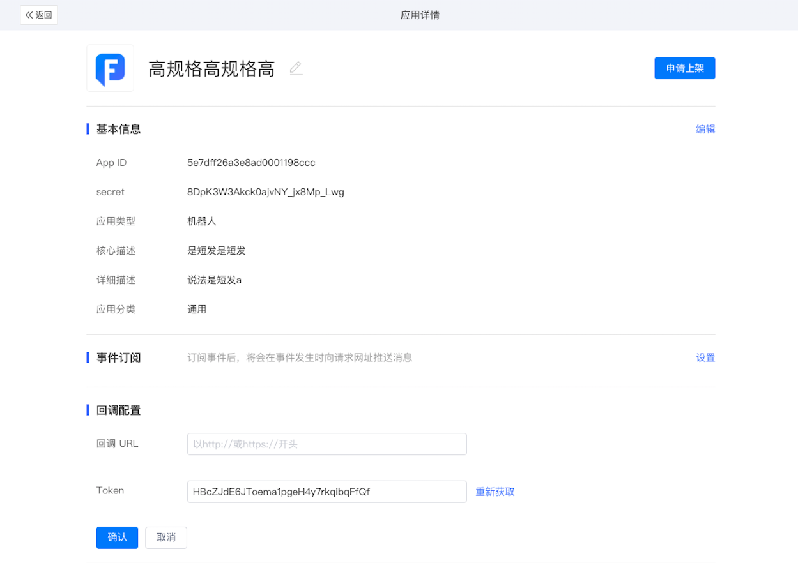
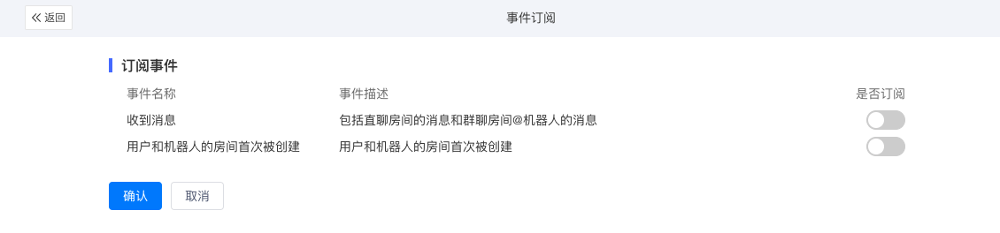
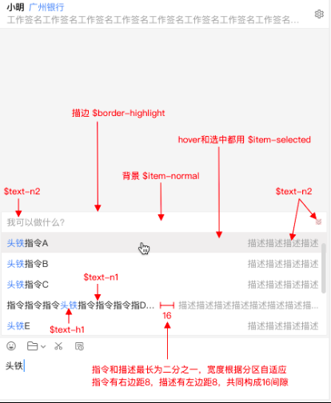
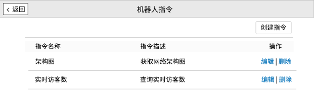
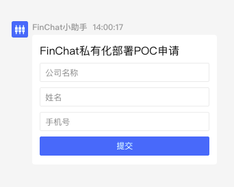

## 概述

机器人应用可以看作是某个外部系统在FinChat的虚拟账号，来自外部系统的通知可以通过会话的形式传递给用户，用户也可以通过会话的形式命令系统执行特定操作。

在FinChat内，机器人应用可以：
* 发送消息：发送给用户或群聊，机器人“说”的能力
* 订阅事件：订阅包括用户发消息给机器人在内的各类事件，机器人“听”的能力
* 指令：定义机器人能响应的一组核心命令
* 会话卡片：一种支持自定义内容与交互的消息类型，可以帮助用户与应用服务建立连接

## 开发指南
机器人应用的创建、上架和测试流程可以查看[自建应用流程](https://docs.finogeeks.club/docs/finchat/#/finstore?id=%E8%87%AA%E5%BB%BA%E5%BA%94%E7%94%A8%E6%B5%81%E7%A8%8B)，本章节主要介绍机器人特有能力的配置与实现。

### 1.发送消息

机器人可以给某个用户或某个群聊发送消息，具体可以查看[发送消息](https://docs.finogeeks.club/docs/finchat/#/api_server?id=%E5%8F%91%E9%80%81%E6%B6%88%E6%81%AF)。

机器人还可以主动创建群聊并发送消息，具体可以查看[群管理](http://)

### 2.订阅事件

订阅事件后，机器人才能接收用户发送的消息，才能在正确的时机主动发送消息给用户。

目前支持的订阅事件和回调接口可以查看[事件订阅](https://docs.finogeeks.club/docs/finchat/#/api_server?id=%E4%BA%8B%E4%BB%B6%E8%AE%A2%E9%98%85)

##### 配置订阅事件

1.回调配置：填写回调URL和Token



2.事件订阅：选择订阅的事件



### 3.指令

通过为机器人添加指令，可以提示用户该如何与机器人进行交互。

当用户与机器人会话时，会在输入框上方提示用户当前机器人支持的指令。用户选择某个指令并发送后，机器人通过接收“接收消息”事件获知指令，再通过发送消息进行相应。



##### 指令配置

在应用开发详情-机器人指令页面，添加和编辑指令。注意，指令必须配合订阅事件才能成功使用。




### 4.会话卡片

会话卡片（Convo UI，简称CUI）是FinChat中的一种消息格式，借由该种消息，用户在房间窗口内就可以完成与系统的复杂数据交互。

FinChat定义了CUI的标准协议，开发者可以任意组合这些元素生成会话卡片，连接用户与系统。

以下图为例，“FinChat小助手”机器人发送的这条CUI消息，由context/input/submit元素组成，用户提交后即回将数据回调给应用的服务。



#### CUI消息结构

```
{
  "body": "[交互卡片]",
  "info": {
    "type": "form",
    "status": "input", // input/loading/disable
    "shared": true,    // 是否为共享消息
    "fcids": [         // 独享消息更新的fcid

    ],
    "elements": [      // 元素可参考下文
    ],
  },
  "msgtype": "m.cui",
  "version": "0.1.0",
}
```

#### CUI消息元素

1.context
text 文本类型

```
    {
      subtype: 'text',
      type: 'context',
      value: 'FinChat私有化部署POC申请'
    },
```

2.divider 分割线

divider  

可选：
height: 表示分割线的粗细（默认是1px）
background: 表示线条的颜

```
    {
      type: 'divider',
      subtype: 'divider',
      height: '1',
      background: '#666'
    },
```

3.image

image

o_url: 获取这个路径，需要先调用上传接口

```
    {
      type: 'image',
      subtype: 'image',
      o_url: 'mxc://dev.finogeeks.club/6465762e66696e6f6765656b732e636c75625e816df2881cef00012a43ed'
    },
```

4.input

text-input

```
    {
      type: 'input',
      subtype: 'text-input', 
      placeholder: '公司名称',
      key: 'company',
      value: '23'
    },
```

dropdown-input

```
    {
      type: 'input',
      subtype: 'dropdown-input',
      key: 'test',
      placeholder: 'test select',
      value: '',
      options: [
        { label: 'test', value: '1' },
        { label: 'test2', value: '2' },
      ],
    },
```

5.button

submit

```
    {
      type: 'button',
      subtype: 'submit',
      value: '提交',
      action: 'submit'
    },
```

reply

    类似问答选择型，该类button就是一个选项
```
    {
      type: 'button',
      subtype: 'reply',
      key: 'test',
      value: '测试reply',
      status: 'xxx'
    },
```

openUrl 

```
    {
      type: 'button',
      subtype: 'openurl',
      action: 'https://www.finogeeks.com/',
      value: 'FinChat',
    }
```
